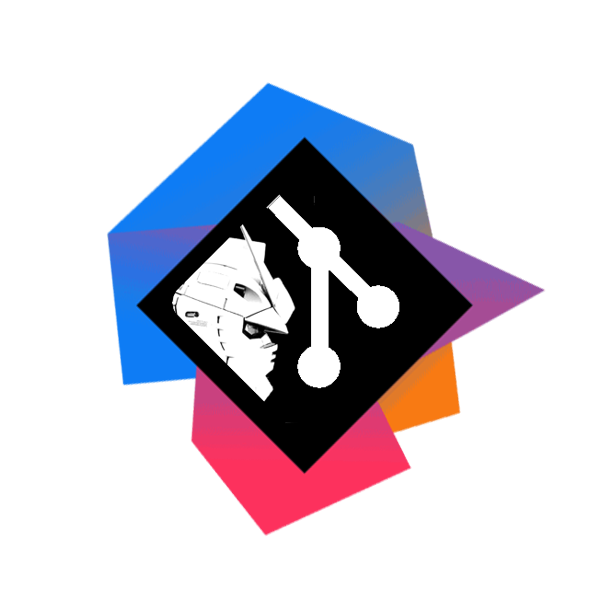

# GUNDAM 프로젝트 

# 0. 개요

### 프로젝트 개요

인텔리제이와 깃허브를 이용한 개발시, 사용자들의 협업과 코드 관리에 도움을 주는 인텔리제이 플러그인`GUNDAM` 입니다.   
`GUNDAM`을 이용하면 `GPT의 코드 분석결과`를 메서드, 클래스 단위로 자동으로 받고 문서로 관리 할수 있습니다.   
깃허브의 같은 원격저장소를 이용해 팀원들과 협업시 인텔리제이 내부에서 실시간으로 팀원들과 상호작용 할 수 있는    
`"깃 컨벤션 커스텀"`,`"핑"`, `"팀원의 현재 작업 파일확인"`, `"메시지 보내기"`의 기능을 이용할수 있고,    
 `코드 하이라이트`, `오류 자동 검색`, 웹에서 `사용자 모니터링 및 문서 확인`등의 부가 기능 또한 사용할 수 있습니다.

### 기술스택

# 1.주요기능

### 1-1. GPT의 코드 분석

#### GPT 요청 보내기

##### GPT 결과 화면

 GPT 결과 화면 상세 기능 

#### GPT의 주석을 자동으로 각 코드 시작 부분에 삽입

#### 로컬에서 마크다운문서로 자동 분석결과 자동 변환가능

#### 각 결과 창을 분리 가능

#### 코드 분석결과를 서버로 보내 프론트에서 읽어오기 가능

#### 기타
- 로딩창
- 타임 아웃창
- 다중 탭 및 각 창을 로딩
- 커밋 메시지 복사

### 1-2. 실시간 작업 상황 공유

### 1-3. 플러그인 세팅 설정 및 컨벤션 기반 커밋 메시지 작성
#### 플러그인 일반 세팅

#### 커밋 컨벤션 세팅

#### 컨벤션이 적용된 커밋 메시지 작성

### 1-4. 코드 분석결과 자동 문서화

### 1-5. 모바일 웹에서 문서 열람

### 1-6. 현재 작업중인 사용자 모니터링

#### GIt 로그인

### 1-7. 모바일 웹에서 온라인 사용자 모니터링

# 2.부가기능

### 2-1. 다른 사용자에게 핑 찍기

### 2-2. 다른 사용자에게 메세지 보내기

### 2-3. 이슈 가져오기

### 2-4. 오류 브라우저로 검색

### 2-5. 코드 하이라이팅

단축키 : alt-a

사용법 : 코드 드래그 후 단축키를 이용해 해당 부분의 배경색을 변경해 하이라이트 가능   
드래그 없이 단축키를 사용하면 색상이 변한다(총 4색 지원) 

### 2-6. 코드 네비게이션

GPT에 요청을 보내기전 쉽게 코드를 확인하거나,    
주석 자동 적용 후 결과를 확인하기 위해 해당 코드로 이동 가능

### 2-7. 커밋 권고 알림

기능 : 사용자가 파일을 일정량 이상 수정하거나, 커밋해야할 파일을 닫을시 알림창이 나타난다.   
commit 버튼을 누르면 커밋 창으로 연결되며 , 버전관리 시스템이 인텔리제이에 설정되어있지 않은경우 이를 설정하는 창으로 넘어간다.
 

### 2-8. 로컬 문서 노션으로 내보내기

### 2-9. 다크 모드

# 4. 역할 분담 및 느낀점

### 오철원[팀장]

역할 :  플러그인 개발, GPT와 api 통신을 위한 SPring Main Server 서버 구현, Jenkins를 이용한 CI/CD, Docker,Aws,Nginx를 활용한 배포관리, 발표  

느낀점 : GPT를 활용한 프로젝트를 전부터 꼭 한번 만들어 보고 싶다고 생각했습니다. 최종단의 편리함만을 만끽하다가 직접 개발해야 하는 입장에 처해보니 생성형 AI라는 것은 편리하지만 정밀하게 쓴다는것은 매우 까다로운 프로젝트라는 것을 알게 되었습니다. 인텔리제이 플러그인을 개발하기 위해 Swing을 사용하다 보니 프론트, 백엔드, 배포까지 Full Stack 영역의 개발을 집중적으로 개발해보는 경험을 얻으니 싸피 입과전부터 꿈이었던 하나의 온전한 서비스를 개발할 수 있는 수준까지 성장하는게 목표였는데 그걸 싸피 마지막 프로젝트에서 이뤘다고 느꼈습니다. 

### 김경주

역할 : [코드 하이라이팅](#2-5-코드-하이라이팅) , [GPT 결과 화면](#1-1-GPT의-코드-분석) , [커밋 권고 알림](#2-7-커밋-권고-알림) ,[코드 문서화](#1-4-코드-분석결과-자동-문서화) 

   인텔리제이 라이브러리를 이용한 플러그인 개발, API 작성

느낀점 :레퍼런스가 많지 않아, 인텔리제이와 상호작용하는 기능하나를 구현하기 위해 미리 확인하고 검증해야할 것이 많은 프로젝트였습니다.
공식문서, 예제 코드를 많이 참고 해야했고,그 과정에서 구현할 기능의 특성에 따라 어떻게 체계화된 접근을 해야하는 지 배울수있었습니다.
 

### 김민구 

역할 : 이슈 가져오기, 오류 메시지 브라우저 검색, Notion 내보내기 기능 개발

느낀점 : 일반인을 대상으로 한 서비스가 아닌 개발자를 대상으로 한 서비스 개발은 처음이었다. 참고할만한 자료도 많지 않았고, 개발 과정의 대부분은 GPT와의 질문과 답변을 통해 이뤄질 수 밖에 없었다. 그럼에도 목표했던 기능들을 성공적으로 구현할 수 있어 다행이라는 생각이 든다.

### 오수빈

역할 : 컴포넌트 구조 설계, 깃허브 레포지토리 별 지표 반영 홈페이지, 날짜 별 문서 목록 트리 구조화, 전체 문서 및 검색 페이지, 클래스 상세 페이지, 메서드 상세 페이지, 온라인 유저 추적 페이지, 다크 및 라이트 모드, 전체 디자인 및 CSS, 전체 와이어 프레임

느낀점 : 아직 배울 게 많고 프론트를 잘 하려면 결국 백도 잘 알아야한다는 것을 다시 한 번 느꼈다. 그래도 혼자서 프론트를 맡아 설계부터 기능까지 전체 과정을 경험해보는 귀중한 경험을 해 감사하다.

### 이강민

역할 : 서비스 아키텍처 설계, Intellij 플러그인 기능 개발 (라이브 세션, Swing GUI), Spring Webflux 소켓 서버 구현, 멀티 엔드포인트 Oauth 2.0 로그인 구현, UCC 제작

느낀점 : 사실은 그냥 해보고 싶은 걸 하자는 생각에 기획도 일찍 되었겠다 일단 해보자는 마음으로 시작했습니다. 그런데 Java Swing이 진짜 큰 장벽이었고 그 다음에는 Oauth2.0 로그인이, 개발 통합에 이어 계속 어려운 점이 나타났습니다. Intellij의 전반적인 구조를 이해하는 것도 ChatGPT와 대화하는 것만으로는 부족하여 JetBrains에서 공개한 Intellij Community 버전의 소스를 찾아서 읽어보고 인텔리제이라는 거대한 자바 앱 하나가 실행되는 프로세스 전체를 이해하고 나서야 플러그인이 제대로 작동할 수 있었습니다. 해보고 싶은 것이 많았지만 전부를 다 하지는 못하고 그동안의 경험으로 우선 순위가 있는 것부터 해결하였습니다.
가장 많은 시간을 들인 부분은 역시 어떻게 사용하는 사람이 편하고, 쉽게 사용할 수 있을까 였습니다. 그렇게 더 효율적인 구조, 오류를 핸들링 하기 쉬운 구조를 고민하면서 성장하는 계기가 되었습니다. SSAFY가 끝나더라도, 코드를 한 번 갈아엎을 각오로 계속해서 진행해보고 싶은 프로젝트라고 생각할 만큼 애정을 가지고 개발하였습니다. 완벽하지는 않아도, 모두가 힘을 모아서 여기까지 온 것을 보면 굉장히 기분이 좋습니다.

### 황유성

역할 : 사용자 커스텀 컨벤션 기반 커밋 메시지 작성 기능, 플러그인 설정 개발

느낀점 : 인텔리제이라는 거대한 플랫폼 위에서 어떤 방식으로 협업을 보조하고 개발 편의성을 높일 수 있는가 하는 질문부터 쉽지 않은 과제였습니다. 어디까지 구현이 가능한가를 알기 위해 ChatGPT, 기존 플러그인의 깃허브 레포, 인텔리제이 플러그인 개발자 커뮤니티 등 다양한 원천을 조사했습니다. 그러나 기존 서비스가 제공하는 것보다 진일보하고 사용자 친화적인 기능을 구현하기 위해 필요한 자원이, 인텔리제이에서 지원되지 않는 경우가 잦았습니다. 통합 개발 환경이 제공하는 높은 자유도 속에서 이뤄지는 사용자의 다양한 행동을 고려하며 그것을 방해하거나 충돌하지 않도록 고민하면서, 사용자 관점을 더욱 섬세하게 이해할 수 있었습니다. 또한 설계 단계에서 추측했던 구현 난이도 및 비용이 통제하기 어려운 예외와 오류를 만나고 급증하는 것을 경험했습니다. 무언가에 의존하는 환경에서 머리로 그려보는 프로토타입이 아닌, 사용자가 신뢰하고 쓸 수 있는 솔루션을 만들기 위해 더욱 보수적인 개발 기간 설정과 테스트 기간 안배가 필요함을 실감했습니다. 그럼에도 팀원들과 서로의 시행착오를 공유하며 목표했던 바를 달성한 점에서 만족스러운 프로젝트였습니다.

